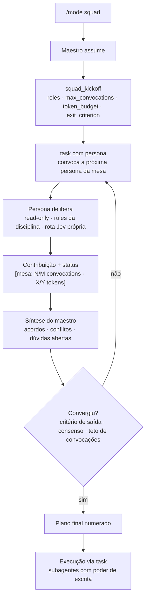
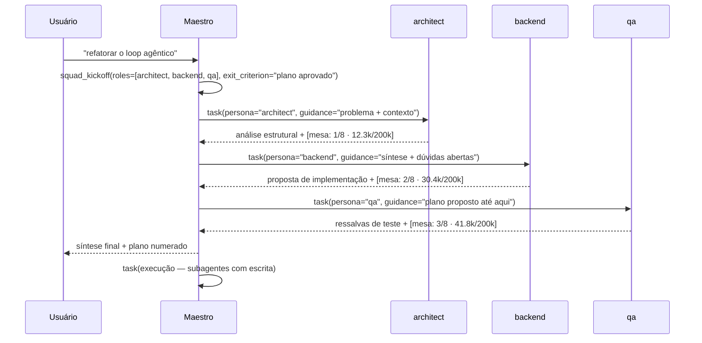

# kterminal

> Um coding agent de terminal em Go, no estilo Claude Code/opencode — com uma mesa de engenharia multi-agente (o **squad mode**) e roteamento de modelo por chamada via **Jev**.

```text
$ go run .
▸ maestro: mesa registrada — roles=[architect backend qa] · 8 convocações · orçamento consultivo
```

## Sumário

- [O que é o kterminal](#o-que-é-o-kterminal)
- [Dois modos de trabalho](#dois-modos-de-trabalho)
- [Squad mode: a mesa de engenharia](#squad-mode-a-mesa-de-engenharia)
  - [A metáfora em uma frase](#a-metáfora-em-uma-frase)
  - [O elenco](#o-elenco)
  - [A vida de uma mesa](#a-vida-de-uma-mesa)
  - [Anatomia de uma rodada](#anatomia-de-uma-rodada)
  - [O que você vê na TUI](#o-que-você-vê-na-tui)
  - [O que cada persona vê (e o que não vê)](#o-que-cada-persona-vê-e-o-que-não-vê)
  - [Convergência e execução](#convergência-e-execução)
  - [Orçamento e limites](#orçamento-e-limites)
  - [Configuração](#configuração)
  - [Personas próprias](#personas-próprias)
  - [FAQ — as perguntas que todo mundo faz](#faq--as-perguntas-que-todo-mundo-faz)
- [Sob o capô](#sob-o-capô)
- [Comandos](#comandos)
- [Desenvolvimento](#desenvolvimento)

---

## O que é o kterminal

Um binário único em Go com uma TUI (Charmbracelet/Bubble Tea) que conversa com LLMs via cliente HTTP próprio (OpenAI-compatible, streaming). O diferencial duplo:

1. **Jev** (roteador externo, Typesafe systemone) escolhe o modelo a **cada chamada**, pesando qualidade, custo e tokens/s **reais medidos** — com fallback heurístico local.
2. **Squad mode**: em vez de um agente solitário, uma *mesa* de personas de engenharia que deliberam entre si até convergir num plano — e só então o plano desce para execução.

## Dois modos de trabalho

| | `/mode sdd` (padrão) | `/mode squad` |
|---|---|---|
| Quando usar | Features novas com spec completa | Spikes, refactors, bugs difíceis, decisões de design |
| Como funciona | Fluxo de skills: brief → PRD → techspec → tasks → implement | Mesa de personas delibera → plano → execução |
| Quem pensa | 1 agente seguindo a skill | Maestro + personas de disciplina |
| Saída | Artefatos `spec/` + código | Plano numerado + código |

O modo ativo aparece no hint bar, persiste no snapshot e é restaurado no `resume`. O padrão é configurável (`squad.default_mode`).

---

## Squad mode: a mesa de engenharia

### A metáfora em uma frase

Imagine uma **reunião de projeto**: um facilitador (o **maestro**) convoca especialistas (as **personas**), **um de cada vez**, resume o que ouviu e repassa ao próximo — até o grupo convergir num plano acionável.

Não é um chat em grupo onde todos falam juntos. É uma roda de conversa **conduzida**: quem faz a ponte entre os especialistas é sempre o maestro.

### O elenco

O maestro é o seu agente principal com outro chapéu: ao ativar `/mode squad`, o system prompt dele é trocado pelo [prompt de maestro](internal/squad/embed/maestro.md). As personas são subagentes especializados, cada um com prompt da disciplina, subset de rules e rota de modelo próprios:

| Persona | Disciplina | Model tags | Rules | Papel na mesa |
|---|---|---|---|---|
| `architect` | architecture | `reasoning` | go, code-standards | Fronteiras de módulos, acoplamento, seams |
| `backend` | backend | `reasoning`, `code` | go, code-standards | Lógica, loops, concorrência, erros |
| `frontend` | frontend | `code` | code-standards | UI, estados, rendering |
| `database` | database | `reasoning` | database | Esquemas, migrações, consultas |
| `ux` | ux | `reasoning` | — | Fluxos, ergonomia, clareza |
| `qa` | qa | `fast` | tests | Critérios de aceite, riscos, cobertura |
| `test` | test | `fast`, `code` | tests, go | Estratégia e casos de teste |

O maestro monta a mesa **por relevância**: num projeto Go de backend, `frontend` e `ux` simplesmente não são convocados.

### A vida de uma mesa



Passo a passo:

1. **Kickoff** — antes de convocar qualquer pessoa, o maestro registra a mesa com `squad_kickoff`: papéis, teto de convocações, orçamento de tokens e **critério de saída** (ex.: *"plano aprovado por todas as disciplinas"*). Sem kickoff, a convocation de persona falha.
2. **Convocation** — o maestro chama `task` com `persona: "<nome>"`, passando no `guidance` o contexto acumulado da mesa. Nasce um subagente isolado com o prompt da disciplina.
3. **Contribuição** — a persona devolve sua análise + uma linha de status `[mesa: 2/8 convocations · 30.4k/200k tokens]` para todos acompanharem o custo.
4. **Síntese** — entre convocações, o maestro produz um bloco de síntese (acordos, conflitos, questões abertas) e drena a fila de mensagens do usuário (ver [FAQ](#faq--as-perguntas-que-todo-mundo-faz)).
5. **Convergência** — a mesa encerra por critério de saída, consenso ou teto de convocações.
6. **Execução** — o plano numerado desce para subagentes de execução (com escrita) via `task`.

### Anatomia de uma rodada



Repare: **as personas nunca se falam diretamente**. Cada seta entre personas passa pelo maestro, que decide o que repassar.

### O que você vê na TUI

Cada contribuição aparece no transcript com rótulo `▸ <papel>:` e cor da disciplina. Em terminais largos (≥ 100 colunas), uma sidebar mostra a mesa ao vivo:

```text
│ squad                                        │ ▸ maestro: mesa registrada — roles=[architect
│ ▸ maestro · deliberating                     │   backend qa] · critério de saída: plano aprovado
│   glm-5.3                                    │
│ ────────────────────────────                 │ ▸ architect: o runLoop mistura decisão de rota
│ ▸ architect · done                           │   e emissão de eventos; proponho extrair o
│   deepseek-v4.1 · 12.3k tok · $0.02          │   watchdog para um tipo próprio...
│   lendo internal/agent/agent.go              │   [mesa: 1/8 convocations · 12.3k/200k tokens]
│ ▸ backend · deliberating                     │
│   glm-5.3 · 18.1k tok · $0.03                │ ▸ backend: concordo com a fronteira, mas o
│   propondo refator do runLoop                │   cancel precisa ser por persona...
│ ▸ qa · waiting                               │   [mesa: 2/8 convocations · 30.4k/200k tokens]
│   —                                          │
│ ────────────────────────────                 │ ▸ maestro: ## Round 2 Synthesis
│ 2/8 convocations                             │   - Acordos: watchdog isolado
│ 30.4k/200k tokens                            │   - Conflitos: escopo do cancel
│                                              │   - Open questions: abort mid-convocation
│                                              │   - Next persona: qa — reason: risco de teste
```

O status de cada persona na sidebar conta a história: `waiting` → `deliberating` → `done`.

### O que cada persona vê (e o que não vê)

<details>
<summary><strong>Clique para expandir: o isolamento de cada persona</strong></summary>

Cada convocation cria um subagente **recém-nascido**, com memória zerada:

- **Vê**: seu system prompt (persona + apenas as rules da sua disciplina), a `description` e o `guidance` que o maestro escolheu repassar, e ferramentas de leitura (`read`, `glob`, `grep`) para inspecionar o código.
- **Não vê**: a conversa das outras personas, o histórico completo da sessão, ferramentas de escrita (`write`/`edit`/`bash` são bloqueados na mesa) e a tool `task` (personas não convocam personas — sem recursão).

É **hub-and-spoke**: o maestro é o único ponto de passagem. Isso tem três consequências práticas:

1. **Contexto cirúrgico** — cada persona recebe só o que importa para a disciplina dela (o maestro é instruído a não fazer bundle do contexto inteiro).
2. **Sem efeito cascata** — uma persona não contaminou a outra; divergências chegam ao maestro, que as explicita na síntese.
3. **Rota independente** — cada persona tem seu próprio critério no Jev: `architect` pede modelos `reasoning`, `qa` pede `fast`. A mesa inteira não paga o preço do modelo mais caro.

</details>

### Convergência e execução

A mesa termina por um destes caminhos:

| Gatilho | Tipo |
|---|---|
| `exit_criterion` declarado no kickoff foi atingido | Convergência |
| Todas as personas concordam com o plano | Convergência |
| Teto de convocações (`max_convocations`) esgotado | Teto duro |
| Usuário pressiona `Esc` | Aborto do turno inteiro |

O orçamento de tokens **não** encerra a mesa — veja [abaixo](#orçamento-e-limites).

Na convergência, o maestro entrega um plano com: problema (um parágrafo), decisões de design (bullets), passos de implementação (numerados, cada um mapeando arquivo/tipo), plano de teste (tabela de casos) e riscos/mitigações. Então chama `task` **sem** persona — que cria subagentes de execução com o registry completo (`read`, `glob`, `grep`, `write`, `edit`, `bash`). A mesa delibera; os subagentes executam.

### Orçamento e limites

| Controle | Natureza | Comportamento |
|---|---|---|
| `token_budget` | **Consultivo** | Aparece no status (`30.4k/200k tokens`, em cor de aviso quando estourado) apenas para informar. **Nunca bloqueia, nunca encerra a mesa.** O maestro pode até declarar um orçamento maior que o configurado — o valor declarado é respeitado. |
| `max_convocations` | **Duro** | É o guarda-chuva real: atingido o teto, a próxima convocation falha com erro e o maestro é obrigado a convergir. |
| Passos por subagente | **Duro** | 20 steps por subagente (persona ou executor). |
| Stall watchdog | **Duro** | 10 min sem progresso aborta o subagente com o parcial renderizado. |
| Profundidade | **Duro** | Subagentes não ganham a tool `task` — sem squads recursivas. |

### Configuração

```toml
# ~/.config/kterminal/config.toml
[squad]
default_mode     = "squad"   # "sdd" (padrão) ou "squad"
max_convocations = 8         # teto duro de convocações por turno
token_budget     = 200000    # orçamento consultivo — informativo, nunca bloqueia

[squad.pins]
architect = "glm-5.3"        # fixa o modelo de uma persona (bypassa o Jev)
```

- `default_mode`: modo inicial de toda sessão.
- `max_convocations`: máximo **configurável**; o maestro pode declarar menos no kickoff, nunca mais.
- `token_budget`: valor **default** quando o kickoff não declara um; dali em diante, só informativo.
- `pins`: override manual de rota por persona.

### Personas próprias

O catálogo de 7 personas vem embutido no binário (`go:embed`), mas o projeto vence: crie `.agents/agents/<nome>/AGENT.md` —

```markdown
---
name: perf
discipline: performance
model-tags: [fast]
rules: [go, code-standards]
---
You are the **perf** persona in a kterminal engineering squad.

Sua disciplina é **performance**. Você raciona sobre hot paths,
alocações, complexidade e custo de algoritmos...
```

- Uma persona do projeto com o mesmo **nome** de uma embutida a **substitui**.
- `rules` lista quais rules (de `.agents/rules/`) injetar no prompt — a persona não recebe o bundle inteiro, só o subset da disciplina.
- `model-tags` entra no critério de rota do Jev para aquela persona.

---

### FAQ — as perguntas que todo mundo faz

<details open>
<summary><strong>Uma persona conversa com a outra?</strong></summary>

**Não diretamente.** É hub-and-spoke: a persona nunca vê a conversa da outra — só recebe o contexto que o maestro repassa no `guidance`. Não é um chat em grupo; é um facilitador fazendo a ponte, rodada a rodada.

</details>

<details open>
<summary><strong>Uma ajuda a outra?</strong></summary>

**Sim, indiretamente.** A contribuição de uma vira contexto da próxima via síntese do maestro. E a mesa é dinâmica: se `architect` e `backend` concordam mas `qa` levanta uma dúvida, o maestro convoca `qa` em seguida. A ordem das convocações segue a relevância, não uma fila fixa.

</details>

<details open>
<summary><strong>Cada um faz um trabalho de cada vez?</strong></summary>

**Sim.** A v1 é estritamente sequencial: a `Mesa` registra os estados `waiting → deliberating → done` e só uma persona fica `deliberating` por vez. O `task` é síncrono — o maestro espera a persona terminar antes de sintetizar e convocar a próxima.

</details>

<details open>
<summary><strong>Duas ou mais personas podem trabalhar ao mesmo tempo?</strong></summary>

**Não na v1.** Paralelismo read-only (convocações sem tools de escrita) é fast-follow previsto no [brief](.docs/12-squad-multi-agente.md), junto com a UI de progresso múltiplo. Por ora: uma rodada, uma voz.

</details>

<details open>
<summary><strong>E se eu digitar no meio da mesa?</strong></summary>

Sua mensagem entra numa **fila** e o maestro a consome entre convocações, incorporando-a ao contexto da próxima. `Esc` continua abortando o turno inteiro (a mesa em progresso é descartada).

</details>

<details open>
<summary><strong>Personas podem escrever código?</strong></summary>

**Na mesa, não.** Personas recebem apenas `read`/`glob`/`grep` — a mesa delibera sobre o código, não o altera. Quem escreve são os subagentes de execução, na fase pós-convergência, com o registry completo.

</details>

<details open>
<summary><strong>Se eu fechar o terminal, perco a mesa?</strong></summary>

Não. O modo e a mesa (papéis, statuses, consumo por persona) persistem no snapshot e são restaurados no `resume`. O transcript JSONL registra o campo `agent` em cada evento — a conversa completa fica auditável.

</details>

---

## Sob o capô

<details>
<summary><strong>Mapa do código do squad mode</strong></summary>

| Caminho | Responsabilidade |
|---|---|
| `internal/squad/squad.go` | Store de personas: catálogo embutido + override do projeto, frontmatter, resolução por nome |
| `internal/squad/kickoff.go` | `Kickoff`, `Limits` e validação (roles existem, convocações clampadas, orçamento default) |
| `internal/squad/mesa.go` | Estado da mesa: entries, statuses, contadores, status line thread-safe |
| `internal/squad/embed/maestro.md` | O prompt do maestro (protocolo de kickoff/convocation/convergência) |
| `internal/squad/embed/personas/*/AGENT.md` | As 7 personas embutidas |
| `internal/agent/agent.go` | `convokePersona`, `runSubagent` (watchdog, eventos), `task` com parâmetro `persona` |
| `internal/tools/squad.go` | Tool `squad_kickoff` |
| `internal/tui/sidebar.go` | Sidebar da mesa (status, modelo, tokens, custo por persona) |

Decisões de projeto: sem novo loop em Go — o squad mode é **prompt-driven** sobre a maquinaria de subagentes existente; assets via `go:embed`; mesa thread-safe (`sync.Mutex`) porque os eventos chegam de goroutines de subagentes.

</details>

<details>
<summary><strong>Como o Jev roteia cada persona</strong></summary>

A cada chamada, o `Router.Route(ctx, state, candidates)` decide o modelo. No squad mode, o `state` carrega o papel da persona e suas `model-tags` entram no `Model.Criteria()` enviado ao Jev — que pesa qualidade, custo e tokens/s reais (telemetria própria). Exemplos: `architect` → tag `reasoning` tende a modelos de raciocínio; `qa` → tag `fast` tende a modelos velozes. Um `pin` por persona (`[squad.pins]`) bypassa o Jev inteiro. Se o Jev cai, o `HeuristicRouter` local assume fazendo keyword-matching do papel.

</details>

<details>
<summary><strong>A ponte com o fluxo SDD</strong></summary>

A mesa não vive fora do processo do repo: personas leem artefatos de `spec/` com as tools de leitura quando existem, e o plano convergido pode alimentar um PRD/techspec. O desenvolvimento do próprio kterminal segue o fluxo kspec (brief → PRD → techspec → tasks) — o squad mode foi especificado em `.docs/12-squad-multi-agente.md` e dogfoodado com uma mesa real (architect + backend + qa) resolvendo um problema do próprio kterminal.

</details>

## Comandos

| Comando | Ação |
|---|---|
| `/mode` | Alterna entre `sdd` e `squad` (popup) |
| `/model <nome>` | Pina um modelo manualmente · `/model auto` devolve ao Jev |
| `/help` | Lista de comandos |
| `/config` | Abre a configuração |
| `/clear`, `/image`, `/exit` | Sessão e anexos |

## Desenvolvimento

```bash
go build ./...                 # build
go run .                       # rodar em desenvolvimento
go vet ./...                   # análise estática
gofmt -l .                     # formatação (não deve listar nada)
go test ./...                  # testes
```

Verificação completa: `go build ./... && go vet ./... && gofmt -l . && go test ./...`

- Código-fonte em inglês, specs e documentação em português (Brasil).
- Sem comentários no código; tools registradas no construtor do `Registry`; assets via `go:embed`.
- Fluxo de entrega: branch de feature → fast-forward `develop` → `main` → push das três.
